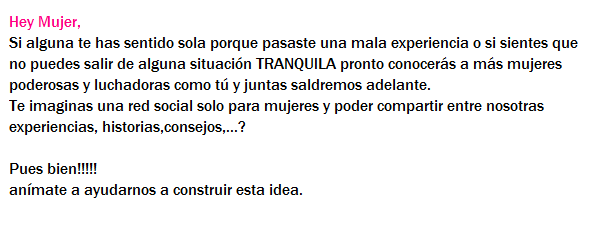
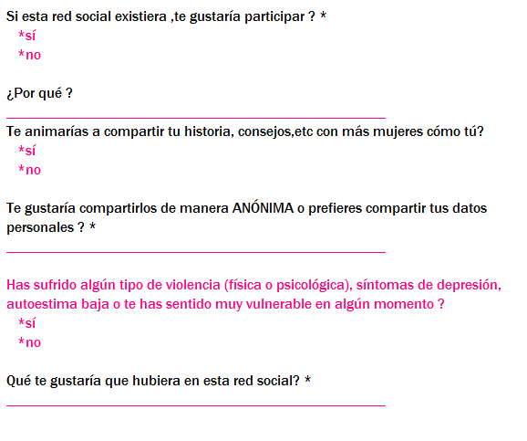
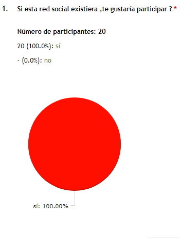
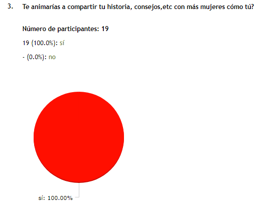
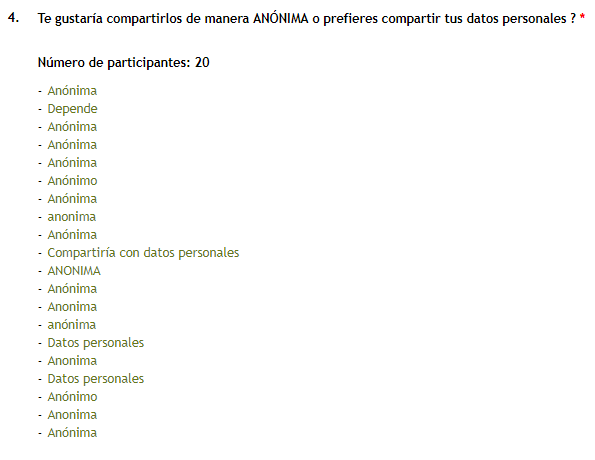
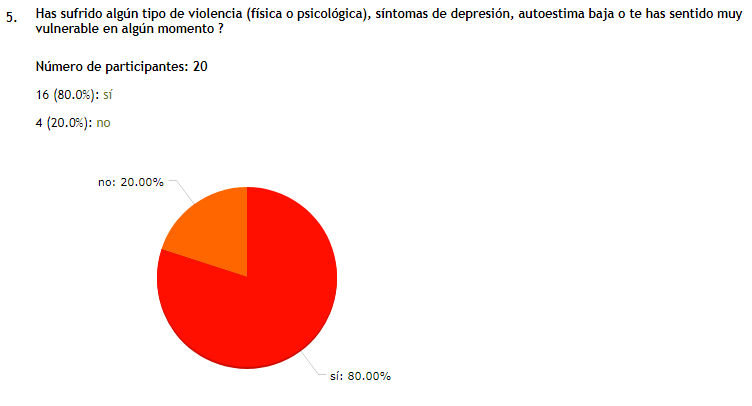
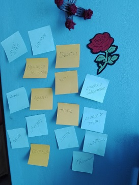

## JUNTAS

JUNTAS es una red social dirigida aquellas mujeres que estan pasando por alguna situación de vulnerabilidad (depresión, abusos, adicciones, baja autoestima...) o aquellas que alguna vez estuvieron es alguna situación similar y no se atrevieron a contar sus historias por MIEDO o VERGÜENZA. En este espacio las mujeres podrán compartir sus historias de manera ÁNONIMA y  recibir consejos y comentarios de otras mujeres, pero sobre todo darse cuenta que  SOMOS MUCHAS las mujeres que pasamos o hemos pasado por lo mismo y no estan SOLAS.

JUNTAS busca revalorar el compromiso de hermandad y apoyo emocional entre mujeres.

### ¿CÓMO SE CREÓ JUNTAS?
#### Investigación
 Como primer paso en la creación de nuestro proyecto se realizó la siguiente encuesta a 20 mujeres :

como resultado a esta encuesta los datos fueron los siguientes:
- El 95.24% de las mujeres encuestadas usarían esta red social y existise.
- 19 de las encuestadas coninciden en que usarían esta red porque les gustaría un espacio en el cual puedan COMPARTIR EXPERIENCIAS, recibir CONSEJOS, SENTIRSE APOYADAS.
- El 100% de las encuestadas se animaría a compartir sus experiencias, pero de manera ANÓNIMA.
- El 81% de las encuestadas ha sufrido algun tipo de abuso o ha pasado por alguna situación de vulnerabilidad.
- Las encuestadas respondieron que les gustaría encontrar un espacio para poder leer HISTORIAS y dar CONSEJOS, les gustaría le hayan FRASES, VIDEOS.

### Brainstorming
 Después de analizar las respuetas de nuestras encuestadas realizamos una mapa de ideas con las posibles herramientas o funcionalidades que usaríamos en nuestra red social :
 

### Herramientas tecnológicas utilizadas
 Una vez definidas las ideas a realizar, empezamos con el preceso de codificar nuestro proyecto y para ellos utilizamos las siguiente herramientas :
- HTML 5
- CSS 3
- JavaScript
- Framework Materialize
- Galería de JavaScript: Jquery
- Herramienta tipográfica GoogleFonts
- Herramienta para guardar base de datos Firebase
- Herramienta para comentarios momentos.js

#### Herramienta adicionales
 Estas herramientas nos ayudaron con la creación de encuestadas, sksketching de muestro proyecto y diseño :
- Marvel app
- Web : www.onlineencuesta.com
- Paint

### Producto Final
 Vistas

